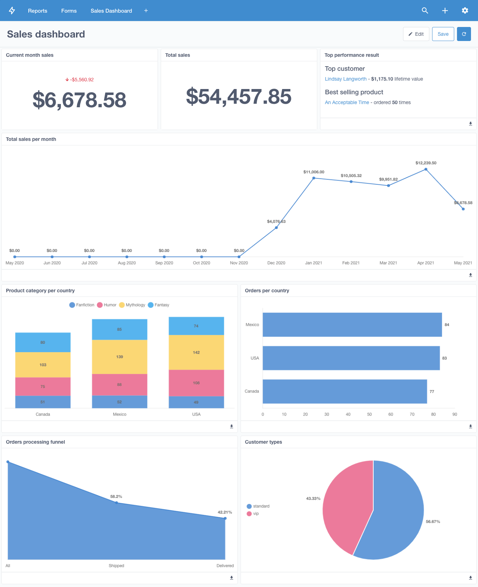
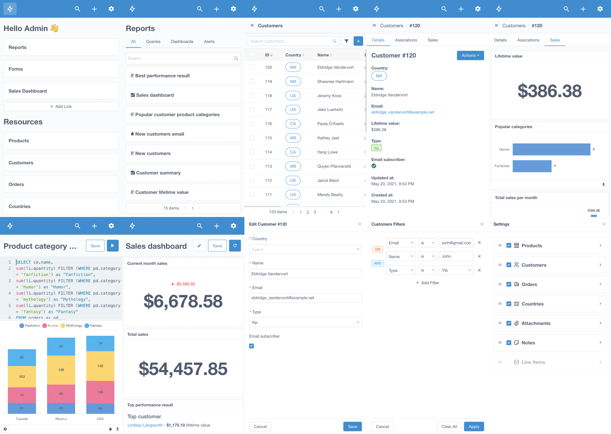

# AdSnap Admin
Admin Dashboard for Teamsnap Brand Experience Platform
-----------
Search, create, update, and delete ad-related entries using a convenient UI. Create complex custom actions like sending an automated email to your partners via API integration. Build custom reports with SQL and visualize the results with charts. Combine individual reports into a single dashboard and share it with your team.




```bash
docker-compose up --build
```

# Watch "AdTech: The Movie"

<a href="https://www.youtube.com/watch?v=KKfPJB2gnJM">Watch Educational Presentation</a>
